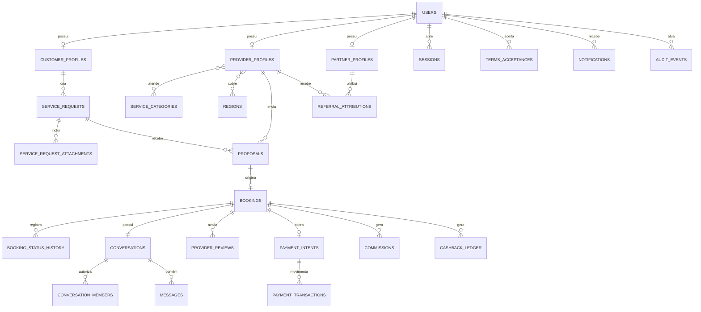

# ERD conceitual

```mermaid
erDiagram
  USERS ||--o| CUSTOMER_PROFILES : possui
  USERS ||--o| PROVIDER_PROFILES : possui
  USERS ||--o| PARTNER_PROFILES : possui
  USERS ||--o{ SESSIONS : abre
  USERS ||--o{ TERMS_ACCEPTANCES : aceita
  PROVIDER_PROFILES }o--o{ SERVICE_CATEGORIES : atende
  PROVIDER_PROFILES }o--o{ REGIONS : cobre
  CUSTOMER_PROFILES ||--o{ SERVICE_REQUESTS : cria
  SERVICE_REQUESTS ||--o{ SERVICE_REQUEST_ATTACHMENTS : inclui
  SERVICE_REQUESTS ||--o{ PROPOSALS : recebe
  PROVIDER_PROFILES ||--o{ PROPOSALS : envia
  PROPOSALS ||--o| BOOKINGS : origina
  BOOKINGS ||--o{ BOOKING_STATUS_HISTORY : registra
  BOOKINGS ||--|| CONVERSATIONS : possui
  CONVERSATIONS ||--o{ CONVERSATION_MEMBERS : autoriza
  CONVERSATIONS ||--o{ MESSAGES : contém
  BOOKINGS ||--o{ PROVIDER_REVIEWS : avalia
  PARTNER_PROFILES ||--o{ REFERRAL_ATTRIBUTIONS : atribui
  PROVIDER_PROFILES ||--o{ REFERRAL_ATTRIBUTIONS : recebe
  BOOKINGS ||--o| PAYMENT_INTENTS : cobra
  PAYMENT_INTENTS ||--o{ PAYMENT_TRANSACTIONS : movimenta
  BOOKINGS ||--o{ COMMISSIONS : gera
  BOOKINGS ||--o{ CASHBACK_LEDGER : gera
  USERS ||--o{ NOTIFICATIONS : recebe
  USERS ||--o{ AUDIT_EVENTS : atua
```

O desenho detalhado será materializado em migration na Fase 1. Entidades reguladas permanecem sem fluxo ativo.
