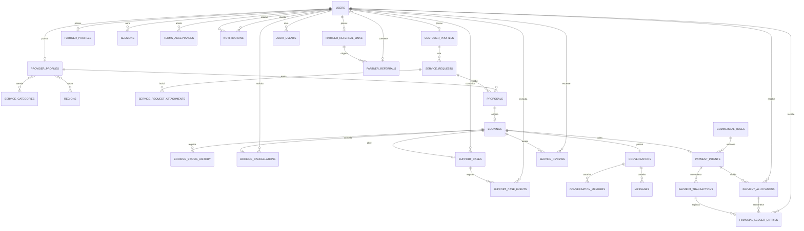

# ERD conceitual

O núcleo transacional demonstrável está materializado em migrations versionadas. O financeiro ativo é exclusivamente sandbox; PSP, custódia e movimentação real permanecem ausentes.
